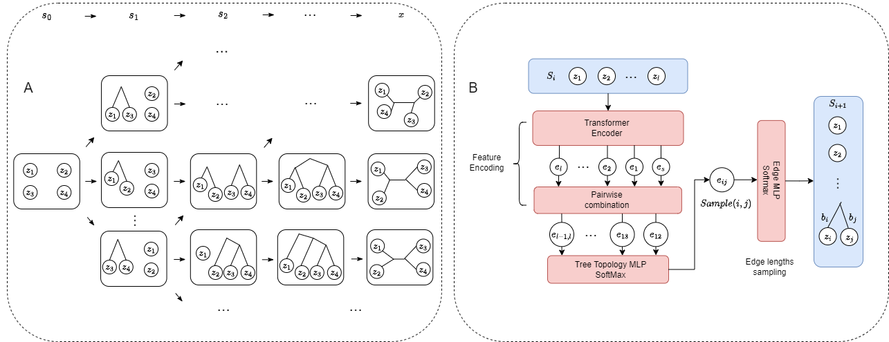

# PhyloGFN: Phylogenetic inference with generative flow networks
Official repository of [PhyloGFN: Phylogenetic inference with generative flow networks](https://openreview.net/forum?id=hB7SlfEmze) (ICLR 2024)

Mingyang Zhou, Zichao Yan, Elliot Layne, Nikolay Malkin, Dinghuai Zhang, Moksh Jain, Mathieu Blanchette, Yoshua Bengio



We design a GFlowNet based generative model for phylogenetic inference, achieving strong results in both Bayesian and parsimony-based phylogenetic inference.

## Citation
```bibtex
@inproceedings{
    zhou2024phylogfn,
    title={Phylo{GFN}: Phylogenetic inference with generative flow networks},
    author={Ming Yang Zhou and Zichao Yan and Elliot Layne and Nikolay Malkin and Dinghuai Zhang and Moksh Jain and Mathieu Blanchette and Yoshua Bengio},
    booktitle={The Twelfth International Conference on Learning Representations},
    year={2024},
    url={https://openreview.net/forum?id=hB7SlfEmze}
}
```


## Environment Setup

```
conda create -n phylogfn python=3.10
conda activate phylogfn
conda install pytorch torchvision torchaudio pytorch-cuda=11.8 -c pytorch -c nvidia
conda install anaconda::docopt
conda install etetoolkit::ete3
conda install matplotlib tqdm dill fvcore iopath docopt
```

## Usage
Our latest progress with continuous branch lengths modeling is implemented. To train a phyogfn model

```buildoutcfg
python train.py <cfg_path> <sequences_path> <output_path> [--nb_device=<device_num>] [--quiet] [--amp]
```
- Example sequences datasets DS1-DS8 are stored in the folder `dataset/benchmark_datasets`
- Example training `<cfg_path>` are stored in the folder `src/configs/benchmark/dna_cfgs`
    - Continuous branch lengths modeling configs are in the folder `continuous_branch_lengths_modeling`
    - Discrete branch lengths modeling configs are in the folder `discrete_branch_lengths`

PhyloGFN with continuous branch length modeling achieves SOTA MLL estimation performance.

|                | Training trajs |     DS1         |     DS2         |     DS3         |     DS4         |     DS5         |     DS6         |     DS7         |     DS8         |  cfg/weights       |
|----------------|----------------|-----------------|-----------------|-----------------|-----------------|-----------------|-----------------|-----------------|-----------------|----------------|
| PhyloGFN Full |    3.20E+07    | -7108.4 (0.04)  | -26367.7 (0.04) | -33735.1 (0.02) | -13329.9 (0.09) | -8214.4 (0.16)  | -6724.2 (0.10)  | -37331.9 (0.14) | -8650.5 (0.05)  |       -        |
| PhyloGFN 40%  |    1.28E+07    | -7108.4 (0.05) | -26367.7 (0.05) | -33735.2 (0.04) | -13330.1 (0.07) | -8214.5 (0.14)  | -6724.3 (0.10)  | -37332.1 (0.27) | -8650.4 (0.16)  |       -        |
| PhyloGFN 24%  |    7.68E+06    | -7108.4 (0.05) | -26367.7 (0.02) | -33735.1 (0.07) | -13330.0 (0.08) | -8214.5 (0.13)  | -6724.2 (0.21)  | -37332.2 (0.26) | -8650.4 (0.15)  | [googledrive](https://drive.google.com/drive/folders/1TbpnCUMvLdYxfr71nY_k5_BftPlaxKYW?usp=drive_link)|


For discrete branch lengths modeling, we suggest to use the config file with the following configurations:

|         |  DS1  |  DS2  |  DS3  |  DS4  |  DS5  |  DS6  |  DS7  |  DS8  |
|---------|-------|-------|-------|-------|-------|-------|-------|-------|
| Bin size| 0.001 | 0.004 | 0.004 | 0.002 | 0.002 | 0.001 | 0.001 | 0.001 |
| Bin num |   50  |   50  |   50  |  100  |  100  |  100  |  200  |  100  |

We will publish the optimized code for parsimony analysis in the near future. In the meantime, if you are interested, please refer to the [supplementary materials](https://openreview.net/attachment?id=hB7SlfEmze&name=supplementary_material) to run parsimony analysis.

## TODO list
- [ ] mutigpu training 
- [ ] parsimony inference


